\#Data Download

First of all, we need to download the raw data into the user’s download
folder.


``` r
#dir.create("~/Downloads/jena_climate", recursive = TRUE)
#download.file(
#  "https://s3.amazonaws.com/keras-datasets/jena_climate_2009_2016.csv.zip",
#  "~/Downloads/jena_climate/jena_climate_2009_2016.csv.zip"
#)
#unzip("~/Downloads/jena_climate/jena_climate_2009_2016.csv.zip",
#      exdir = "~/Downloads/jena_climate")

library(tibble)
library(readr)
library(ggplot2)
library(keras)
library(tensorflow)
```

# Data Preparation

``` r
data_dir <- "~/Downloads/jena_climate"
fname <- file.path(data_dir, "jena_climate_2009_2016.csv")
raw_data <- read_csv(fname)
```

    ## 
    ## -- Column specification --------------------------------------------------------
    ## cols(
    ##   `Date Time` = col_character(),
    ##   `p (mbar)` = col_double(),
    ##   `T (degC)` = col_double(),
    ##   `Tpot (K)` = col_double(),
    ##   `Tdew (degC)` = col_double(),
    ##   `rh (%)` = col_double(),
    ##   `VPmax (mbar)` = col_double(),
    ##   `VPact (mbar)` = col_double(),
    ##   `VPdef (mbar)` = col_double(),
    ##   `sh (g/kg)` = col_double(),
    ##   `H2OC (mmol/mol)` = col_double(),
    ##   `rho (g/m**3)` = col_double(),
    ##   `wv (m/s)` = col_double(),
    ##   `max. wv (m/s)` = col_double(),
    ##   `wd (deg)` = col_double()
    ## )

``` r
glimpse(raw_data)
```

    ## Rows: 420,451
    ## Columns: 15
    ## $ `Date Time`       <chr> "01.01.2009 00:10:00", "01.01.2009 00:20:00", "01...
    ## $ `p (mbar)`        <dbl> 996.52, 996.57, 996.53, 996.51, 996.51, 996.50, 9...
    ## $ `T (degC)`        <dbl> -8.02, -8.41, -8.51, -8.31, -8.27, -8.05, -7.62, ...
    ## $ `Tpot (K)`        <dbl> 265.40, 265.01, 264.91, 265.12, 265.15, 265.38, 2...
    ## $ `Tdew (degC)`     <dbl> -8.90, -9.28, -9.31, -9.07, -9.04, -8.78, -8.30, ...
    ## $ `rh (%)`          <dbl> 93.3, 93.4, 93.9, 94.2, 94.1, 94.4, 94.8, 94.4, 9...
    ## $ `VPmax (mbar)`    <dbl> 3.33, 3.23, 3.21, 3.26, 3.27, 3.33, 3.44, 3.44, 3...
    ## $ `VPact (mbar)`    <dbl> 3.11, 3.02, 3.01, 3.07, 3.08, 3.14, 3.26, 3.25, 3...
    ## $ `VPdef (mbar)`    <dbl> 0.22, 0.21, 0.20, 0.19, 0.19, 0.19, 0.18, 0.19, 0...
    ## $ `sh (g/kg)`       <dbl> 1.94, 1.89, 1.88, 1.92, 1.92, 1.96, 2.04, 2.03, 1...
    ## $ `H2OC (mmol/mol)` <dbl> 3.12, 3.03, 3.02, 3.08, 3.09, 3.15, 3.27, 3.26, 3...
    ## $ `rho (g/m**3)`    <dbl> 1307.75, 1309.80, 1310.24, 1309.19, 1309.00, 1307...
    ## $ `wv (m/s)`        <dbl> 1.03, 0.72, 0.19, 0.34, 0.32, 0.21, 0.18, 0.19, 0...
    ## $ `max. wv (m/s)`   <dbl> 1.75, 1.50, 0.63, 0.50, 0.63, 0.63, 0.63, 0.50, 0...
    ## $ `wd (deg)`        <dbl> 152.3, 136.1, 171.6, 198.0, 214.3, 192.7, 166.5, ...

Visualize data using ggplot. The first command provides an overview of
the whole data set from 2009 to 2016, while the second zoom into the
first 1000 lines of data (100x10mins of data since 2009)

``` r
ggplot(raw_data, aes(x = 1:nrow(raw_data), y = `T (degC)`)) + geom_line()
```

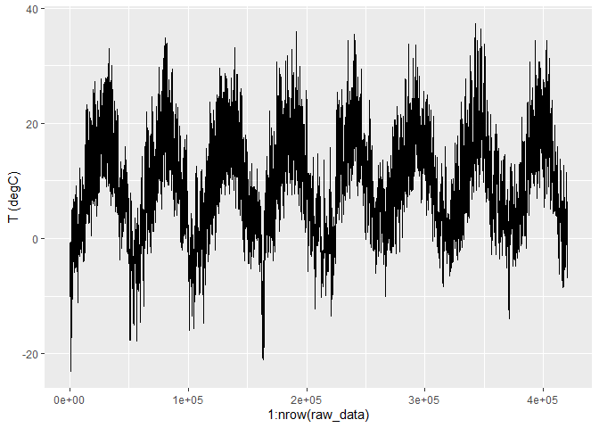<!-- -->

``` r
ggplot(raw_data[1:1000, ], aes(x = 1:1000, y = `T (degC)`)) + geom_line()
```

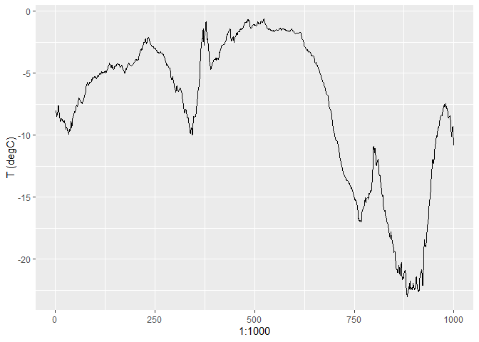<!-- -->

The data is not in the proper format, so it will need some cleaning up.
The chunk of code below scale and normalised the data, so it can be fed
into the network later. Most libraries don’t like to handle data that is
not between -1 to 1.

``` r
data <- data.matrix(raw_data[, -1])

mean <- apply(data, 2, mean)
std <- apply(data, 2, sd)
data <- scale(data, center = mean, scale = std)

normalize <- function(x) {
  return ((x - min(x)) / (max(x) - min(x)))
}

max <- apply(data,2,max)
min <- apply(data,2,min)

data <- apply(data, 2, normalize)

plot(data[1:30000,2 ])
```

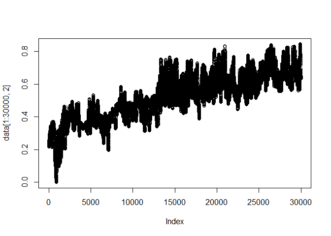<!-- -->

``` r
plot(data[30000:50000,2 ])
```

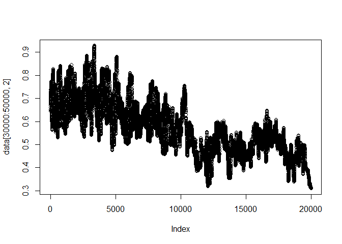<!-- -->

With such a large dataset, it is often difficult to directly compute all
the possible time point relationships. Thus, a generator function is
needed. The chunk of code below generates pairs of data that correlate
to each other and selected data from different time points for training,
testing and validation. This is to ensure we are not overfitting the ML
model.

``` r
generator <- function(data,
                      lookback,
                      delay,
                      min_index,
                      max_index,
                      shuffle = FALSE,
                      batch_size = 128,
                      step = 6) {
  if (is.null(max_index))
    max_index <- nrow(data) - delay - 1
  i <- min_index + lookback
  function() {
    if (shuffle) {
      rows <-
        sample(c((min_index + lookback):max_index), size = batch_size)
    } else {
      if (i + batch_size >= max_index)
        i <<- min_index + lookback
      rows <- c(i:min(i + batch_size - 1, max_index))
      i <<- i + length(rows)
    }
    samples <- array(0, dim = c(length(rows),
                                lookback / step,
                                dim(data)[[-1]]))
    targets <- array(0, dim = c(length(rows)))
    
    for (j in 1:length(rows)) {
      indices <- seq(rows[[j]] - lookback, rows[[j]] - 1,
                     length.out = dim(samples)[[2]])
      samples[j, , ] <- data[indices, ]
      targets[[j]] <- data[rows[[j]] + delay, 2]
    }
    list(samples, targets)
  }
}

lookback <- 1440
step <- 6
delay <- 44
batch_size <- 64

train_gen <- generator(
  data,
  lookback = lookback,
  delay = delay,
  min_index = 1,
  max_index = 30000,
  shuffle = FALSE,
  step = step,
  batch_size = batch_size)
```

First, a basic feed-forward neural network model. This model tried to
flatten the 2D array of (time vs variables) into a 1D array before
feeding it to the network. This is extremely fast and easy, but often,
not as reliable/accurate.


``` r
lookback <- 240
step <- 1
delay <- 44
batch_size <- 64

train_gen <- generator(
  data,
  lookback = lookback,
  delay = delay,
  min_index = 1,
  max_index = 30000,
  shuffle = FALSE,
  step = step,
  batch_size = batch_size)

train_gen_data <- train_gen()

model <- keras_model_sequential() %>%
  layer_flatten(input_shape = c(lookback / step, dim(data)[-1])) %>%
  layer_dense(units = 128, activation = "relu") %>%
  layer_dense(units = 64, activation = "relu") %>%
  layer_dense(units = 1)

summary(model)
```

    ## Model: "sequential"
    ## ________________________________________________________________________________
    ## Layer (type)                        Output Shape                    Param #     
    ## ================================================================================
    ## flatten (Flatten)                   (None, 3360)                    0           
    ## ________________________________________________________________________________
    ## dense_2 (Dense)                     (None, 128)                     430208      
    ## ________________________________________________________________________________
    ## dense_1 (Dense)                     (None, 64)                      8256        
    ## ________________________________________________________________________________
    ## dense (Dense)                       (None, 1)                       65          
    ## ================================================================================
    ## Total params: 438,529
    ## Trainable params: 438,529
    ## Non-trainable params: 0
    ## ________________________________________________________________________________

``` r
model %>% compile(optimizer = optimizer_rmsprop(),
                  loss = "mae")

history <- model %>% fit(
  train_gen_data[[1]],train_gen_data[[2]],
  batch_size = 32,
  epochs = 20,
  use_multiprocessing = T
)
```

Now lets print out the predicted data from our flatten network

``` r
  batch_size_plot <- 17600
  lookback_plot <- lookback
  step_plot <- 1 
  
  pred_gen <- generator(
    data,
    lookback = lookback_plot,
    delay = 0,
    min_index = 30000,
    max_index = 50000,
    shuffle = FALSE,
    step = step_plot,
    batch_size = batch_size_plot
  )
  
  pred_gen_data <- pred_gen()
  
  V1 = seq(1, length(pred_gen_data[[2]]))
  
  plot_data <-
    as.data.frame(cbind(V1, pred_gen_data[[2]]))
  
  inputdata <- pred_gen_data[[1]]
  dim(inputdata) <- c(batch_size_plot, lookback, 14)
  
  pred_out <- model %>%
    predict(inputdata) 
  
  plot_data <-
    cbind(plot_data, pred_out)
  
  p <-
    ggplot(plot_data, aes(x = V1, y = V2)) + geom_point(colour = "blue", size = 0.1,alpha=0.4)
  p <-
    p + geom_point(aes(x = V1, y = pred_out), colour = "red", size = 0.1 ,alpha=0.4)
  
  p
```

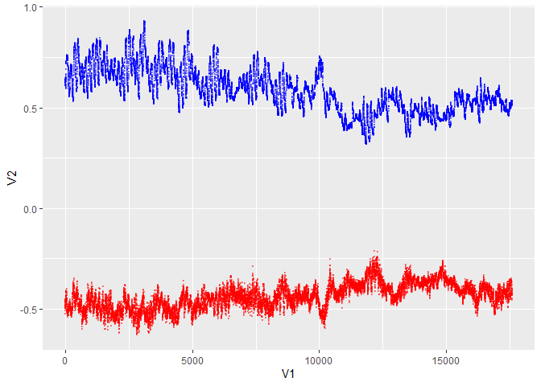<!-- -->

Next, a basic unrolling of the generator function. Generator functions
are used when the dataset output is too big to be fitted into the memory
of a computer. However, to ease understanding, this chunk of code
attempts to emulate the generator functions, whereby. It calculates the
required input directly into a tensor, and uses the pre-calculated
tensor to compute the model, thus, avoiding the use of a generator
function (Which generates the tensor during the training steps). Take
note the slow process of generating the tensor as you go long.

To help with the limitation in computing power, only 1D will be used
here. The time-series of temperature, ignoring all other parameters.
Thus, it will only be generating a matrix as input, not a tensor

An example in Spreadsheet style
<https://docs.google.com/spreadsheets/d/1kzeNMLw43US_5X4aE6XMLYkjDO5q7v96U5v6uApaJ8c/edit#gid=0>


``` r
T_data <- data[1:10000, 2]

x1 <- data.frame()
for (i in 1:10000) {
  x1 <- rbind(x1, t(rev(T_data[i:(i + 240)])))
  if(i%%100 == 0){print(i)}
}
```

    ## [1] 100
    ## [1] 200
    ## [1] 300
    ## [1] 400
    ## [1] 500
    ## [1] 600
    ## [1] 700
    ## [1] 800
    ## [1] 900
    ## [1] 1000
    ## [1] 1100
    ## [1] 1200
    ## [1] 1300
    ## [1] 1400
    ## [1] 1500
    ## [1] 1600
    ## [1] 1700
    ## [1] 1800
    ## [1] 1900
    ## [1] 2000
    ## [1] 2100
    ## [1] 2200
    ## [1] 2300
    ## [1] 2400
    ## [1] 2500
    ## [1] 2600
    ## [1] 2700
    ## [1] 2800
    ## [1] 2900
    ## [1] 3000
    ## [1] 3100
    ## [1] 3200
    ## [1] 3300
    ## [1] 3400
    ## [1] 3500
    ## [1] 3600
    ## [1] 3700
    ## [1] 3800
    ## [1] 3900
    ## [1] 4000
    ## [1] 4100
    ## [1] 4200
    ## [1] 4300
    ## [1] 4400
    ## [1] 4500
    ## [1] 4600
    ## [1] 4700
    ## [1] 4800
    ## [1] 4900
    ## [1] 5000
    ## [1] 5100
    ## [1] 5200
    ## [1] 5300
    ## [1] 5400
    ## [1] 5500
    ## [1] 5600
    ## [1] 5700
    ## [1] 5800
    ## [1] 5900
    ## [1] 6000
    ## [1] 6100
    ## [1] 6200
    ## [1] 6300
    ## [1] 6400
    ## [1] 6500
    ## [1] 6600
    ## [1] 6700
    ## [1] 6800
    ## [1] 6900
    ## [1] 7000
    ## [1] 7100
    ## [1] 7200
    ## [1] 7300
    ## [1] 7400
    ## [1] 7500
    ## [1] 7600
    ## [1] 7700
    ## [1] 7800
    ## [1] 7900
    ## [1] 8000
    ## [1] 8100
    ## [1] 8200
    ## [1] 8300
    ## [1] 8400
    ## [1] 8500
    ## [1] 8600
    ## [1] 8700
    ## [1] 8800
    ## [1] 8900
    ## [1] 9000
    ## [1] 9100
    ## [1] 9200
    ## [1] 9300
    ## [1] 9400
    ## [1] 9500
    ## [1] 9600
    ## [1] 9700
    ## [1] 9800
    ## [1] 9900
    ## [1] 10000

``` r
x1 <- x1[,order(ncol(x1):1)]

x <- as.matrix(x1[,-241])
y <- as.matrix(x1[, 241])

dim(x) <- c(10000, 240, 1)
```

Now we train the model using the tensor we generated

``` r
model <- keras_model_sequential() %>%
  layer_lstm(units = 64, input_shape = c(240, 1)) %>%
  layer_dense(units = 64, activation = "relu") %>%
  layer_dense(units = 16, activation = "relu") %>%
  layer_dense(units = 8, activation = "relu") %>%
  layer_dense(units = 1, activation = "relu") 

summary(model)
```

    ## Model: "sequential_1"
    ## ________________________________________________________________________________
    ## Layer (type)                        Output Shape                    Param #     
    ## ================================================================================
    ## lstm (LSTM)                         (None, 64)                      16896       
    ## ________________________________________________________________________________
    ## dense_6 (Dense)                     (None, 64)                      4160        
    ## ________________________________________________________________________________
    ## dense_5 (Dense)                     (None, 16)                      1040        
    ## ________________________________________________________________________________
    ## dense_4 (Dense)                     (None, 8)                       136         
    ## ________________________________________________________________________________
    ## dense_3 (Dense)                     (None, 1)                       9           
    ## ================================================================================
    ## Total params: 22,241
    ## Trainable params: 22,241
    ## Non-trainable params: 0
    ## ________________________________________________________________________________

``` r
model %>% compile(loss = 'mean_squared_error', optimizer = 'adam',metrics='mse')

history <-
  model %>% fit (
    x,
    y,
    batch_size = 100,
    epochs = 5,
    validation_split = 0.1,
    use_multiprocessing = T
  )

#validation_data = val_gen,
#validation_steps = val_steps

plot(history)
```

<!-- -->

Once we get that out of the way, we can try to plot out our results as
compared to the original data we trained on. To avoid overfitting, we
will be testing the data from 30000rows onwards, so the training and
testing data are completely from a different source.

``` r
  batch_size_plot <- 19760
  lookback_plot <- 240
  step_plot <- 1 
  
  pred_gen <- generator(
    data,
    lookback = lookback_plot,
    delay = 0,
    min_index = 30000,
    max_index = 50000,
    shuffle = FALSE,
    step = step_plot,
    batch_size = batch_size_plot
  )
  
  pred_gen_data <- pred_gen()
  
  V1 = seq(1, length(pred_gen_data[[2]]))
  
  plot_data <-
    as.data.frame(cbind(V1, pred_gen_data[[2]]))
  
  inputdata <- pred_gen_data[[1]][,,2]
  dim(inputdata) <- c(batch_size_plot,lookback_plot, 1)
  
  pred_out <- model %>%
    predict(inputdata) 
  
  plot_data <-
    cbind(plot_data, pred_out)
  
  p <-
    ggplot(plot_data, aes(x = V1, y = V2)) + geom_point( colour = "blue", size = 0.1,alpha=0.4)
  p <-
    p + geom_point(aes(x = V1, y = pred_out), colour = "red", size = 0.1 ,alpha=0.4)
  
  p
```

<!-- -->

Then, the real LSTM with generator functions

``` r
lookback <- 240
step <- 1
delay <- 44
batch_size <- 128

train_gen <- generator(
  data,
  lookback = lookback,
  delay = delay,
  min_index = 1,
  max_index = 30000,
  shuffle = FALSE,
  step = step,
  batch_size = batch_size)

train_gen_data <- train_gen() 

model <- keras_model_sequential() %>%
  layer_lstm(units = 64, input_shape = list(NULL, dim(data)[[-1]])) %>%
  layer_dense(units = 64, activation = "relu") %>%
  layer_dense(units = 32, activation = "relu") %>%
  layer_dense(units = 1, activation = "relu")

model %>% compile(optimizer = optimizer_rmsprop(),
                  loss = "mae")

summary(model)
```

    ## Model: "sequential_2"
    ## ________________________________________________________________________________
    ## Layer (type)                        Output Shape                    Param #     
    ## ================================================================================
    ## lstm_1 (LSTM)                       (None, 64)                      20224       
    ## ________________________________________________________________________________
    ## dense_9 (Dense)                     (None, 64)                      4160        
    ## ________________________________________________________________________________
    ## dense_8 (Dense)                     (None, 32)                      2080        
    ## ________________________________________________________________________________
    ## dense_7 (Dense)                     (None, 1)                       33          
    ## ================================================================================
    ## Total params: 26,497
    ## Trainable params: 26,497
    ## Non-trainable params: 0
    ## ________________________________________________________________________________

``` r
history <- model %>% fit(
  train_gen_data[[1]],train_gen_data[[2]],
  batch_size = 4,
  step_per_epoch = 1,
  epochs = 5,
  use_multiprocessing = T
)
```

Lastly, we plot out the prediction vs target data again.

``` r
  batch_size_plot = 17600
  lookback_plot <- 240
  step_plot <- 1 
  
  pred_gen <- generator(
    data,
    lookback = lookback_plot,
    delay = 0,
    min_index = 30000,
    max_index = 50000,
    shuffle = FALSE,
    step = step_plot,
    batch_size = batch_size_plot
  )
  
  pred_gen_data <- pred_gen()
  
  V1 = seq(1, length(pred_gen_data[[2]]))
  
  plot_data <-
    as.data.frame(cbind(V1, pred_gen_data[[2]]))
  
  inputdata <- pred_gen_data[[1]][,,]
  dim(inputdata) <- c(batch_size_plot,lookback_plot, 14)
  
  pred_out <- model %>%
    predict(inputdata) 
  
  plot_data <-
    cbind(plot_data, pred_out[])
  
  p <-
    ggplot(plot_data, aes(x = V1, y = V2)) + geom_point( colour = "blue", size = 0.1,alpha=0.4)
  p <-
    p + geom_point(aes(x = V1, y = pred_out), colour = "red", size = 0.1 ,alpha=0.4)
  
  p
```

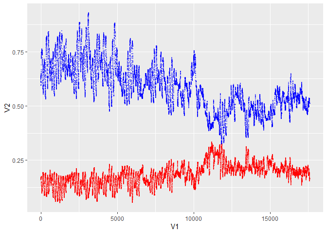<!-- -->

Data exploration and reduction

``` r
data <- data.matrix(raw_data[50000:100000, -1])

mean <- apply(data, 2, mean)
std <- apply(data, 2, sd)
data <- scale(data, center = mean, scale = std)

normalize <- function(x) {
  return ((x - min(x)) / (max(x) - min(x)))
}

max <- apply(data,2,max)
min <- apply(data,2,min)

data <- apply(data, 2, normalize)

data2 <- (data-0.5)

plot(data2[,2])
```

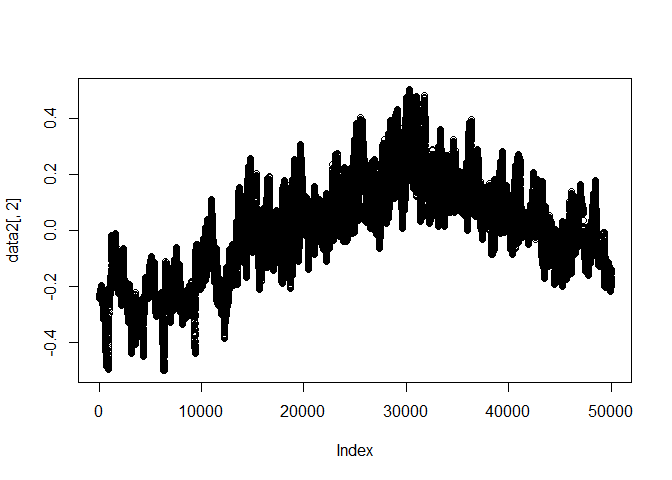<!-- -->

``` r
for (j in 1:14){
  plot(data2[10000:20000,j])
}
```

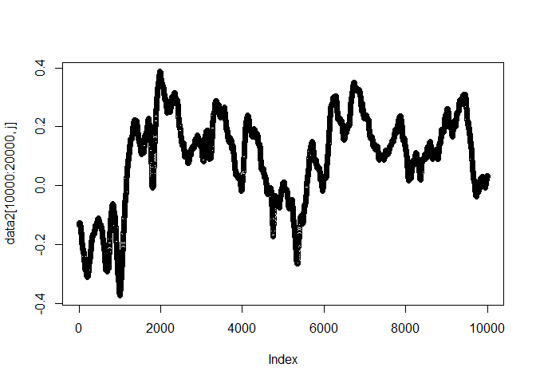<!-- -->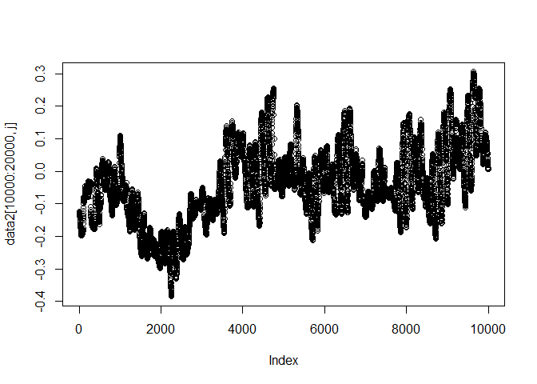<!-- -->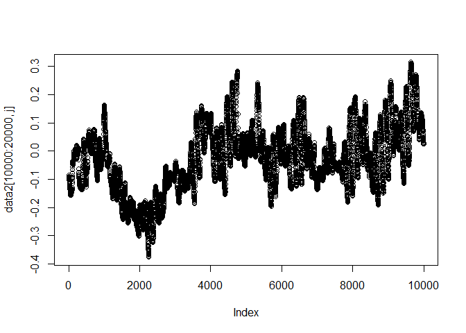<!-- -->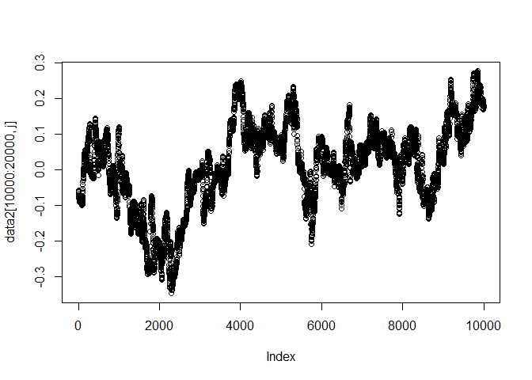<!-- -->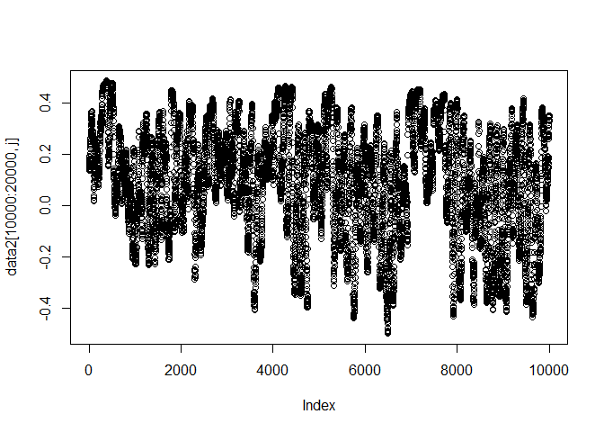<!-- -->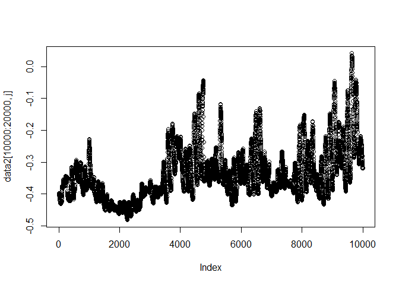<!-- -->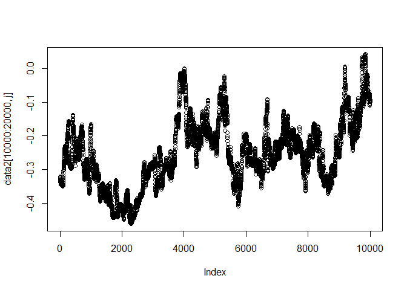<!-- -->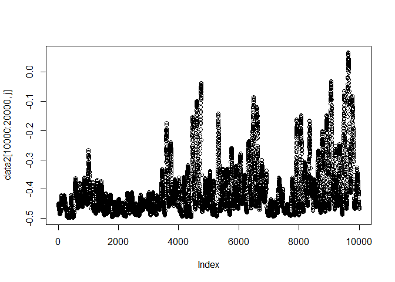<!-- --><!-- -->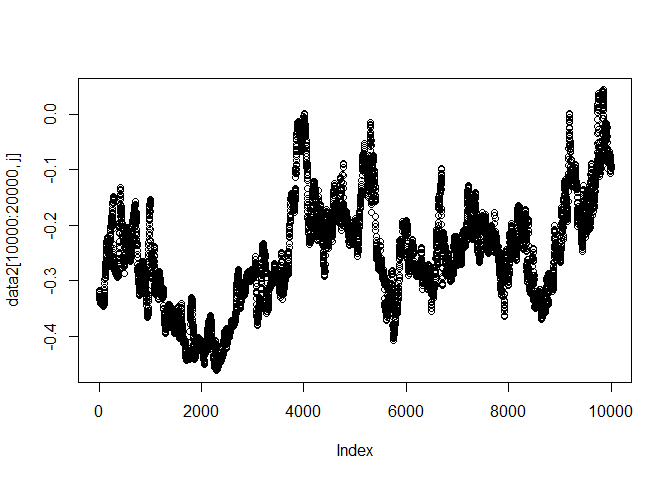<!-- -->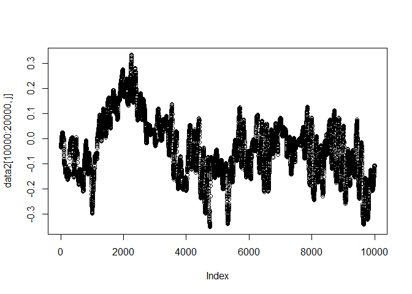<!-- -->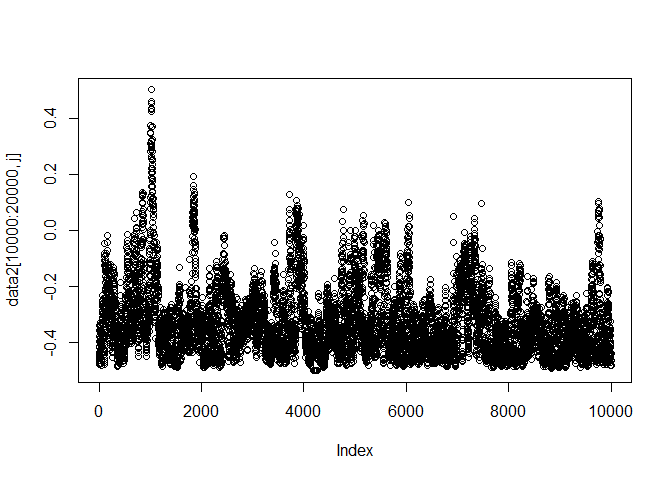<!-- -->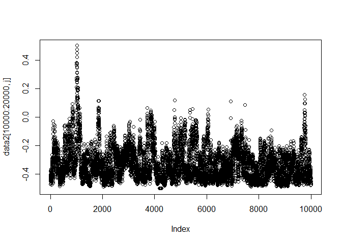<!-- -->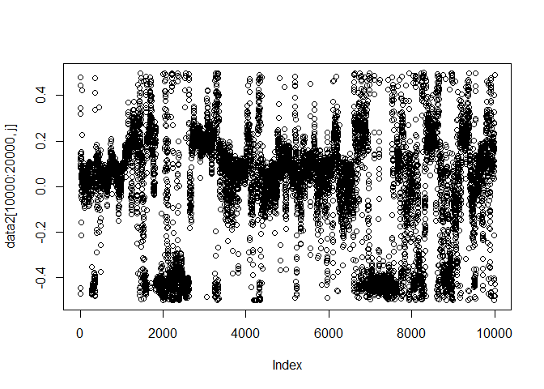<!-- -->

``` r
data3 <- data2[,c(2,3)]
```

``` r
####################################################################################

lookback <- 28
step <- 1
delay <- 0
batch_size <- 2560

train_gen <- generator(
  data3,
  lookback = lookback,
  delay = delay,
  min_index = 1,
  max_index = 30000,
  shuffle = FALSE,
  step = step,
  batch_size = batch_size)

val_gen <- generator(
  data3,
  lookback = lookback,
  delay = delay,
  min_index = 30000,
  max_index = 50000,
  shuffle = FALSE,
  step = step,
  batch_size = batch_size)

train_gen_data <- train_gen()
val_gen_data <- val_gen()

model <- keras_model_sequential() %>%
  layer_gru(units = 64, return_sequences = TRUE,input_shape = list(NULL, dim(data3)[[-1]])) %>%
  bidirectional(layer_gru(units = 64)) %>%
  layer_dense(units = 64, activation = "tanh") %>%
  layer_dense(units = 32, activation = "tanh") %>%
  layer_dense(units = 1, activation = "tanh")

model %>% compile(optimizer = optimizer_rmsprop(),
                  loss = "mae")

summary(model)
```

    ## Model: "sequential_3"
    ## ________________________________________________________________________________
    ## Layer (type)                        Output Shape                    Param #     
    ## ================================================================================
    ## gru_1 (GRU)                         (None, None, 64)                12864       
    ## ________________________________________________________________________________
    ## bidirectional (Bidirectional)       (None, 128)                     49536       
    ## ________________________________________________________________________________
    ## dense_12 (Dense)                    (None, 64)                      8256        
    ## ________________________________________________________________________________
    ## dense_11 (Dense)                    (None, 32)                      2080        
    ## ________________________________________________________________________________
    ## dense_10 (Dense)                    (None, 1)                       33          
    ## ================================================================================
    ## Total params: 72,769
    ## Trainable params: 72,769
    ## Non-trainable params: 0
    ## ________________________________________________________________________________

``` r
callbacks = callback_early_stopping(monitor = "val_loss", min_delta = 0,
                                    patience = 10, verbose = 0, mode = "auto",
                                    baseline = NULL, restore_best_weights = TRUE)


history <- model %>% fit(
  train_gen_data[[1]],train_gen_data[[2]],
  batch_size = 32,
  epochs = 50,
  callbacks = callbacks,
  validation_data = val_gen_data,
  validation_steps = 5)
```

``` r
batch_size_plot <- 19500
lookback_plot <- 15
step_plot <- 1

pred_gen <- generator(
  data3,
  lookback = lookback_plot,
  delay = 0,
  min_index = 30000,
  max_index = 50000,
  shuffle = FALSE,
  step = step_plot,
  batch_size = batch_size_plot
)

pred_gen_data <- pred_gen()

V1 = seq(1, length(pred_gen_data[[2]]))

plot_data <-
  as.data.frame(cbind(V1, pred_gen_data[[2]]))

inputdata <- pred_gen_data[[1]][, , ]
dim(inputdata) <- c(batch_size_plot, lookback_plot, 2)

pred_out <- model %>%
  predict(inputdata)

plot_data <-
  cbind(plot_data, pred_out[])

p <-
  ggplot(plot_data, aes(x = V1, y = V2)) + geom_point(colour = "blue",
                                                      size = 0.1,
                                                      alpha = 0.4)
p <-
  p + geom_point(
    aes(x = V1, y = pred_out),
    colour = "red",
    size = 0.1 ,
    alpha = 0.4
  )

p
```

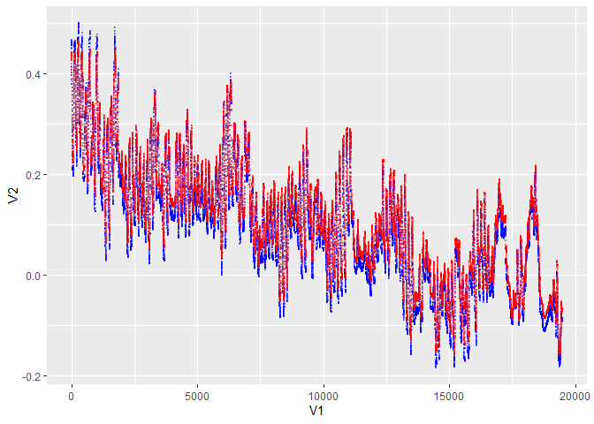<!-- -->
